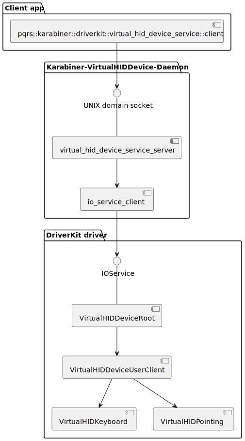

[](https://github.com/pqrs-org/Karabiner-DriverKit-VirtualHIDDevice/actions)
[](https://github.com/pqrs-org/Karabiner-DriverKit-VirtualHIDDevice/blob/main/LICENSE.md)

# Karabiner-DriverKit-VirtualHIDDevice

This project implements a virtual keyboard and virtual mouse using DriverKit on macOS.
These virtual devices are recognized by macOS as same as physical hardware, allowing you to control macOS with keystrokes and mouse inputs from the virtual devices.

The client for controlling the virtual devices is provided as a header-only C++ library.
By integrating this library, your software can control the virtual devices.

**Note:**
The ability to send keystrokes and mouse inputs means having full control over macOS.
Therefore, to prevent malicious software from manipulating the virtual devices, the virtual devices will only accept commands from processes running with root privileges.
This means that the software incorporating the client library must be run with root privileges.

## Supported systems

-   macOS 14 Sonoma
    -   Both Intel-based Macs and Apple Silicon Macs
-   macOS 13 Ventura
    -   Both Intel-based Macs and Apple Silicon Macs

## Screenshots

-   macOS Settings (macOS detects the virtual keyboard)<br/><br />
    <br /><br />

---

## Usage

1.  Open `dist/Karabiner-DriverKit-VirtualHIDDevice-x.x.x.pkg`.
2.  Install files via installer.
3.  Execute the following command in Terminal.

    ```shell
    /Applications/.Karabiner-VirtualHIDDevice-Manager.app/Contents/MacOS/Karabiner-VirtualHIDDevice-Manager activate
    ```

4.  Run Karabiner-VirtualHIDDevice-Daemon:

    ```shell
    sudo '/Library/Application Support/org.pqrs/Karabiner-DriverKit-VirtualHIDDevice/Applications/Karabiner-VirtualHIDDevice-Daemon.app/Contents/MacOS/Karabiner-VirtualHIDDevice-Daemon'
    ```

5.  Run a client program to test the driver extension.

    ```shell
    git clone --depth 1 https://github.com/pqrs-org/Karabiner-DriverKit-VirtualHIDDevice.git
    cd Karabiner-DriverKit-VirtualHIDDevice/examples/virtual-hid-device-service-client
    brew install xcodegen
    make
    make run
    ```

## Uninstallation

1.  Run uninstaller in Terminal.

    ```shell
    bash '/Library/Application Support/org.pqrs/Karabiner-DriverKit-VirtualHIDDevice/scripts/uninstall/deactivate_driver.sh'
    sudo bash '/Library/Application Support/org.pqrs/Karabiner-DriverKit-VirtualHIDDevice/scripts/uninstall/remove_files.sh'
    ```

### Installed files

-   `/Applications/.Karabiner-VirtualHIDDevice-Manager.app`
-   `/Library/Application Support/org.pqrs/Karabiner-DriverKit-VirtualHIDDevice`
-   `/Library/Application Support/org.pqrs/tmp`
-   `/var/log/karabiner`

---

## How to build a package from source code

-   macOS 14+
-   Xcode 15+
-   Command Line Tools for Xcode
-   [XcodeGen](https://github.com/yonaskolb/XcodeGen)

### Obtain DriverKit entitlements

To create an App ID that supports the `com.apple.developer.driverkit` entitlement required for distributing DriverKit drivers, you need to apply to Apple with your Apple ID to obtain the necessary permissions.

Specifically, follow the instructions on [Requesting Entitlements for DriverKit Development](https://developer.apple.com/documentation/driverkit/requesting_entitlements_for_driverkit_development)

Note: This process may take some time to be completed on Apple's side.

### Create App IDs

Create the following App IDs on the [Apple Developer](https://developer.apple.com/account/resources/identifiers/list) site.

<table>
    <thead>
        <tr>
            <th>Bundle ID</th>
            <th>Capabilities</th>
            <th>App Services</th>
            <th>Additional Capabilities</th>
        </tr>
    </thead>
    <tbody>
        <tr>
            <td>org.pqrs.Karabiner-DriverKit-VirtualHIDDevice</td>
            <td>---</td>
            <td>---</td>
            <td>
                com.apple.developer.driverkit<br/>
                com.apple.developer.driverkit.family.hid.device<br/>
                com.apple.developer.driverkit.family.hid.eventservice<br/>
                com.apple.developer.driverkit.transport.hid<br/>
                com.apple.developer.hid.virtual.device<br/>
            </td>
        </tr>
        <tr>
            <td>org.pqrs.Karabiner-VirtualHIDDevice-Daemon</td>
            <td>---</td>
            <td>---</td>
            <td>---</td>
        </tr>
        <tr>
            <td>org.pqrs.Karabiner-VirtualHIDDevice-Manager</td>
            <td>
                System Extension<br/>
            </td>
            <td>---</td>
            <td>---</td>
        </tr>
    </tbody>
</table>

<table><tr><td><!-- border hack -->

</td></tr></table>

### Grant permission for com.apple.developer.driverkit.userclient-access from Apple

The entitlement of `com.apple.developer.driverkit.userclient-access` must be applied for from Apple, and unless individually authorized, it cannot be granted to your application.
You can apply through the request form: <https://developer.apple.com/contact/request/system-extension/>

### Create a profile corresponding to the App IDs on the Apple Developer site

| Profile      | App ID                                        | Entitlements                                                        |
| ------------ | --------------------------------------------- | ------------------------------------------------------------------- |
| Developer ID | org.pqrs.Karabiner-DriverKit-VirtualHIDDevice | DriverKit and System Extension Template for XXXXXXXX (Developer ID) |
| Developer ID | org.pqrs.Karabiner-VirtualHIDDevice-Daemon    | DriverKit and System Extension Template for XXXXXXXX (Developer ID) |
| Developer ID | org.pqrs.Karabiner-VirtualHIDDevice-Manager   | Default                                                             |

Please ensure that `com.apple.developer.driverkit.userclient-access` appears under Extended Entitlements when you select `DriverKit and System Extension Template` in Entitlements.

<table><tr><td><!-- border hack -->
<br /><br />
</td></tr></table>

### Replace the `*.provisionprofile` files in the repository with your own provision profile files

-   src/Daemon/Developer_ID_KarabinerVirtualHIDDeviceDaemon.provisionprofile
-   src/DriverKit/Developer_ID_KarabinerDriverKitVirtualHIDDevice.provisionprofile
-   src/Manager/Developer_ID_KarabinerVirtualHIDDeviceManager.provisionprofile

### Replace team identifier, domain and embedded.provisionprofile

Search `G43BCU2T37` and replace them with your team identifier.

```shell
git grep G43BCU2T37 src/
```

### Open Terminal.app to create a package

The rest of the operations will be performed in the terminal.

### Set environment variables for signing

Set the following environment variables for application signing and package signing.​

-   `PQRS_ORG_CODE_SIGN_IDENTITY`
-   `PQRS_ORG_INSTALLER_CODE_SIGN_IDENTITY`

You can determine the values using the following methods:

Find the value for `PQRS_ORG_CODE_SIGN_IDENTITY`:

```shell
security find-identity -p codesigning -v | grep 'Developer ID Application'
```

```text
    2) BD3B995B69EBA8FC153B167F063079D19CCC2834 "Developer ID Application: Fumihiko Takayama (G43BCU2T37)"
```

Then, set `PQRS_ORG_CODE_SIGN_IDENTITY`

```shell
export PQRS_ORG_CODE_SIGN_IDENTITY=BD3B995B69EBA8FC153B167F063079D19CCC2834
```

Find the value for `PQRS_ORG_INSTALLER_CODE_SIGN_IDENTITY`:

```shell
security find-identity -p basic -v | grep 'Developer ID Installer'
```

```text
  1) C3107C61DB3605DA2D4549054B225DAFB1D6FA2D "Developer ID Installer: Fumihiko Takayama (G43BCU2T37)"
```

Then, set `PQRS_ORG_INSTALLER_CODE_SIGN_IDENTITY`

```shell
export PQRS_ORG_INSTALLER_CODE_SIGN_IDENTITY=C3107C61DB3605DA2D4549054B225DAFB1D6FA2D
```

### Build a package

```shell
make package
```

`dist/Karabiner-DriverKit-VirtualHIDDevice-X.X.X.pkg` will be generated.

### Notarize the package

Create App-Specific Passwords on <https://appleid.apple.com>.

-   name: `pqrs.org notarization`

Execute `store-credentials`

```shell
xcrun notarytool store-credentials --apple-id tekezo@pqrs.org --team-id G43BCU2T37

Profile name:
> pqrs.org notarization

App-specific password for tekezo@pqrs.org:
> The password you created earlier
```

Then, notarize the package:

```shell
make notarize
```

---

## More detailed information

### Components

Karabiner-DriverKit-VirtualHIDDevice consists the following components.

-   Extension Manager (including DriverKit driver)
    -   `/Applications/.Karabiner-VirtualHIDDevice-Manager.app`
    -   It provides a command line interface to activate or deactivate DriverKit driver.
-   Karabiner-VirtualHIDDevice-Daemon
    -   `/Library/Application Support/org.pqrs/Karabiner-DriverKit-VirtualHIDDevice/Applications/Karabiner-VirtualHIDDevice-Daemon.app`
    -   It mediates between the client app and the driver.
    -   It allows apps to communicate with the virtual device even if the app is not signed with pqrs.org's code signing identity.
        (The client app must be running with root privileges.)
-   Client apps
    -   Client apps are not included in the distributed package.
    -   For example, you can build the client app from `examples/virtual-hid-device-service-client` in this repository.
    -   Client apps can send input events by communicating with Karabiner-VirtualHIDDevice-Daemon via UNIX domain socket.
        (`/Library/Application Support/org.pqrs/tmp/rootonly/vhidd_server/*.sock`)



### Versions

Version is defined in `version.json`.

-   `package_version`:
    -   Karabiner-DriverKit-VirtualHIDDevice package version.
    -   Increment this when any components are updated.
-   `driver_version`:
    -   DriverKit driver internal version.
    -   Increment this when the driver source code is updated.
-   `client_protocol_version`:
    -   The version for communication between Karabiner-VirtualHIDDevice-Daemon and the DriverKit driver.
    -   Increment this when the communication specifications are changed.

### Run Karabiner-VirtualHIDDevice-Daemon via launchd

Karabiner-VirtualHIDDevice-Daemon requires high responsiveness, so it is recommended to run it via launchd with the `ProcessType: Interactive` specified.
There is an example application for registration with launchd in `examples/SMAppServiceExample`, which you can refer to for registering with launchd.

### Extra documents

-   [How to be close to DriverKit](DEVELOPMENT.md)
-   [Extracts from xnu](XNU.md)
